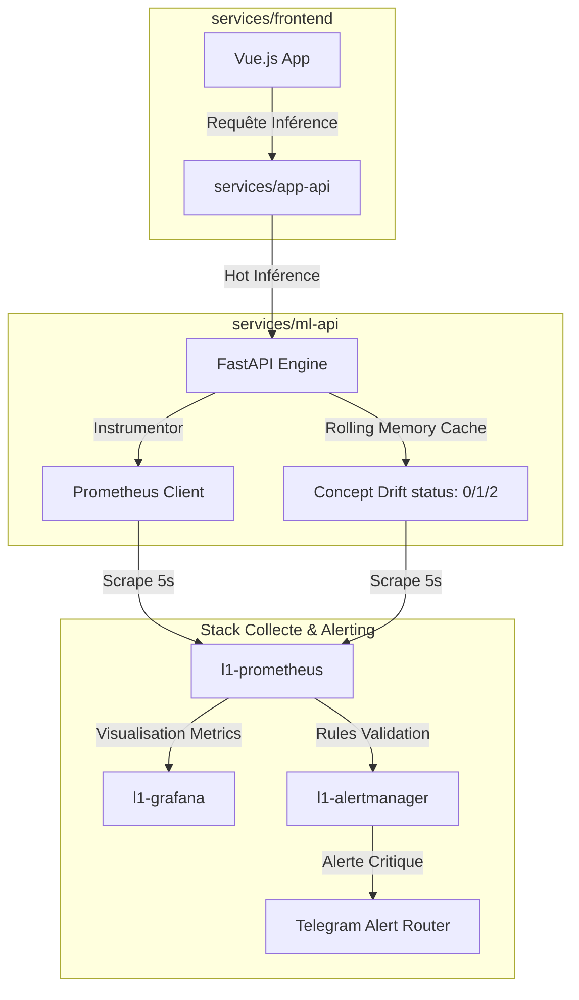

# 🎛️ Observabilité & Supervision Industrielle - Ligue 1 DataLab

Ce document détaille notre stratégie globale de supervision, de télémétrie et de gestion d'incidents (SRE Playbook) pour garantir la robustesse opérationnelle de la plateforme de prédiction IA devant le jury.

---

## 🏗️ Architecture Globale de Télémétrie

Notre système de supervision assure une visibilité de bout en bout en corrélant la santé de l'infrastructure et la dérive de l'intelligence artificielle.



---

## 📈 Les Métriques Clés d'Observabilité

Nous surveillons en direct deux typologies de métriques pour garantir un service à haut niveau de service (SLA) :

### 1. Métriques Applicatives (SRE Golden Signals)
* **Trafic (Throughput)** : Nombre de requêtes d'inférence par seconde, catégorisé par code HTTP (`200 OK`, `500 Error`) pour détecter les surcharges de requêtes.
* **Erreurs** : Suivi des échecs d'API via les compteurs Prometheus (`l1_ml_predictions_total`).
* **Temps de réponse (Latency)** : Suivi en direct pour garantir des temps de réponse inférieurs à 15 millisecondes par prédiction.

### 2. Métriques de Qualité Machine Learning (MLOps Telemetry)
* **`l1_ml_active_model_accuracy`** : Taux de réussite du modèle champion en production sur les prédictions réelles.
* **`l1_ml_active_model_brier_score`** : Mesure de la qualité de la calibration probabiliste (proche de `0.0` = modèle parfait et digne de confiance).
* **`l1_ml_concept_drift_status`** : Surveillance de la stabilité comportementale. Si le comportement de la Ligue 1 évolue brusquement (mercato, tactiques, etc.), l'indicateur bascule automatiquement :
  * `0` $\to$ **Stable** (Confiance nominale).
  * `1` $\to$ **Déviation suspectée** (Mise sous surveillance).
  * `2` $\to$ **Drift Critique** (Réentraînement obligatoire).

---

## 🛡️ SRE Game Day Playbook (Gestion des Incidents)

Ce guide de survie opérationnel décrit comment réagir rapidement face aux 3 incidents de production majeurs pouvant survenir en cours d'exploitation ou de soutenance.

### 🚨 Incident A : Détection de Drift Critique (`status = 2`)
* **Symptôme visuel** : La jauge "Concept Drift" vire au **rouge** sur le tableau de bord *AI Insights*. Le graphique de calibration commence à s'écarter fortement de la diagonale idéale.
* **Cause** : Les statistiques du championnat de Ligue 1 ont glissé (changement de dynamique de saison, mercato d'hiver).
* **Action corrective** :
  1. Accédez à l'onglet **AI Insights** sur le frontend.
  2. Cliquez sur le bouton de commande **"Déclencher Pipeline MLOps"**.
  3. Suivez la reconstruction à chaud dans le terminal de logs de build en direct.
  4. Le pipeline va ingérer les derniers résultats, calculer les Elos, tester le Challenger (Random Forest calibré par régression isotonique), et s'il est meilleur, le promouvoir à chaud comme nouveau Champion avec zéro downtime.

### 🚨 Incident B : Panne du Moteur d'Inférence (`ml-api` Down)
* **Symptôme visuel** : Message d'erreur rouge sur le frontend : *"Le service ML-API est inaccessible"*. La cible (target) Prometheus affiche le conteneur en rouge (`DOWN`).
* **Cause** : Arrêt accidentel du processus ou manque de ressources mémoire.
* **Action corrective** :
  1. Ouvrez un terminal sur votre machine hôte.
  2. Vérifiez le statut des conteneurs : `docker compose ps`
  3. Consultez les logs d'erreurs récents : `docker compose logs --tail=50 ml-api`
  4. Redémarrez le conteneur isolé de manière sécurisée :
     ```bash
     docker compose restart ml-api
     ```
  5. Vérifiez le retour de l'état fonctionnel : `curl http://localhost:8001/`

### 🚨 Incident C : Dégradation de l'Accuracy sous $50\%$
* **Symptôme visuel** : L'indicateur d'Accuracy chute de manière persistante sur Grafana, et le Brier Score de validation dépasse $0.55$.
* **Cause** : Overfitting ou corruption de données lors d'une promotion Champion-Challenger.
* **Action corrective** :
  1. Inspectez le fichier de registre **`ml/models/metadata.json`** pour auditer l'historique des runs.
  2. Rétablissez la dernière version saine du modèle en forçant l'identifiant de version active (`active_version`) dans le fichier metadata.
  3. L'API ML détectera le changement en moins de 10 millisecondes et rechargera à chaud l'ancienne version saine (rollback de secours immédiat).
