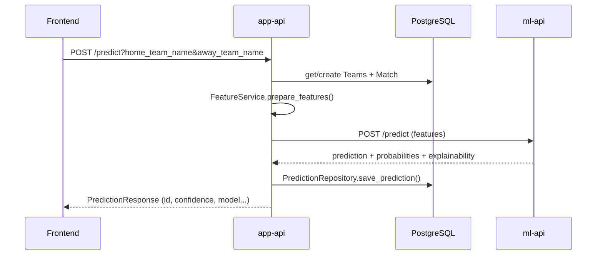

# L1 DataLab — Backend Implementation

Documentation de l'implémentation backend actuelle : **App API** (façade produit), persistance, ML, RAG et intégrations externes.

---

## 1. Architecture globale

```text
┌─────────────┐     JWT      ┌──────────────────┐     HTTP     ┌─────────────┐
│  Frontend   │ ──────────► │    app-api       │ ──────────► │   ml-api    │
│  Vue.js     │   :8002     │    FastAPI       │   :8001     │  FastAPI    │
└─────────────┘             └────────┬─────────┘             └─────────────┘
                                     │
                    ┌────────────────┼────────────────┐
                    ▼                ▼                ▼
              PostgreSQL         Redis           LFP API
              (db-app)          (cache)        (live data)
                    │
              Ollama (optionnel)
              RAG génération LLM
```

| Service | Port local | Rôle |
|---------|------------|------|
| `app-api` | 8002 | Auth, métier, RAG, proxy ML |
| `ml-api` | 8001 | Inférence RandomForest / XGBoost |
| `db-app` | 5434 | PostgreSQL applicatif |
| `redis` | 6379 | Cache LFP |

---

## 2. Structure App API (`services/app-api/`)

```text
app/
├── main.py                 # Routes FastAPI
├── core/
│   ├── database.py         # AsyncSession SQLAlchemy + commit auto
│   ├── security.py         # JWT, bcrypt
│   └── cache.py            # Redis
├── models/models.py        # User, Team, Match, Prediction, RAG
├── schemas/schemas.py      # Pydantic request/response
├── repositories/           # Couche données
│   ├── user_repository.py
│   ├── team_repository.py
│   ├── match_repository.py
│   └── prediction_repository.py
├── services/
│   ├── ml_client.py        # Client HTTP ml-api
│   ├── feature_service.py  # Feature engineering
│   ├── lfp_client.py       # API Ligue 1 + fallbacks
│   └── prediction_history.py
└── rag/
    ├── orchestrator.py     # Pipeline RAG complet
    ├── memory/             # Conversations, embeddings
    ├── retrieval/          # Context builder LFP
    ├── generation/         # Ollama, fallback, SSE
    ├── ranking/            # Mood engine, confidence
    └── prompts/            # Templates système
```

Démarrage : `start.sh` → wait PostgreSQL → `alembic upgrade head` → Uvicorn.

---

## 3. Modèle de données

### Tables principales

| Table | Description |
|-------|-------------|
| `users` | Comptes (username, email, hashed_password) |
| `teams` | Clubs (elo, form_5, logo_url, stats ML) |
| `matches` | Rencontres (cotes, scores, status) |
| `prediction_history` | Prédictions utilisateur (H/D/A + probas) |
| `rag_conversations` | Sessions Oracle |
| `rag_messages` | Messages user/assistant + embeddings JSON |

### Relations clés

```text
User 1──N Prediction N──1 Match N──1 Team (home)
                              └──1 Team (away)
User 1──N RagConversation 1──N RagMessage
```

Init SQL : `db/init_app.sql` (users). Migrations Alembic : teams, matches, prediction_history, RAG.

---

## 4. Endpoints REST

### Santé & racine

| Méthode | Route | Auth | Description |
|---------|-------|------|-------------|
| GET | `/` | — | Message bienvenue |
| GET | `/health` | — | `{ "status": "healthy" }` |

### Authentification

| Méthode | Route | Auth | Description |
|---------|-------|------|-------------|
| POST | `/auth/login` | — | OAuth2 form → JWT (`access_token`) |
| POST | `/users` | — | Inscription |
| GET | `/users/me` | ✅ | Profil courant |

### Prédictions & données live

| Méthode | Route | Auth | Description |
|---------|-------|------|-------------|
| POST | `/predict` | ✅ | Prédiction + sauvegarde historique |
| GET | `/predictions` | ✅ | Historique utilisateur sérialisé |
| GET | `/matches` | — | Liste matchs |
| GET | `/standings` | — | Classement LFP (cache Redis) |
| GET | `/current-matchday` | — | Journée courante |
| GET | `/top-scorers` | — | Meilleurs buteurs |

### RAG / AI Oracle

| Méthode | Route | Auth | Description |
|---------|-------|------|-------------|
| POST | `/insights/question` | ✅ | Réponse JSON complète |
| POST | `/insights/question/stream` | ✅ | Flux SSE (tokens + meta mood) |

---

## 5. Flux prédiction (`POST /predict`)



### Normalisation équipes

`normalize_team_name()` mappe alias courants :

- PSG / Paris → `Paris Saint-Germain`
- OM → `Marseille`
- OL → `Lyon`, etc.

### Feature engineering

`FeatureService` combine stats DB (elo, form_5, avg_overall, squad_value) et cotes dérivées pour le modèle ML.

---

## 6. Historique prédictions (`GET /predictions`)

### Problème résolu (async SQLAlchemy)

Erreur initiale : `MissingGreenlet` lors de la sérialisation `match.home_team` / `away_team`.

**Fix** : `selectinload` au lieu de `joinedload` dans `PredictionRepository.get_user_predictions()` :

```python
.options(
    selectinload(Prediction.match).selectinload(Match.home_team),
    selectinload(Prediction.match).selectinload(Match.away_team),
)
```

### Sérialisation

`prediction_to_history()` → `PredictionHistoryResponse` avec :

- `match` (home/away team, date, status)
- `predicted_result`, `prob_h/d/a`
- `real_home_score`, `real_away_score`, `real_status`

---

## 7. Client LFP (`lfp_client.py`)

- Fetch classement, matchday, buteurs via API Ligue 1
- Cache Redis (TTL 60–120 s)
- **Fallback local** si API indisponible (logos hardcodés par club)
- Format URLs logos LFP (`_format_url`)

Utilisé par : `/standings`, contexte RAG, dashboard frontend.

---

## 8. Pipeline RAG (`rag/orchestrator.py`)

### Composants

| Module | Rôle |
|--------|------|
| `memory/repository.py` | CRUD conversations, messages, retrieval |
| `memory/embeddings.py` | Embeddings légers (JSON) |
| `retrieval/context_builder.py` | Contexte LFP + prédictions user |
| `ranking/mood.py` | Mood Oracle + confidence estimate |
| `generation/ollama.py` | LLM local si `OLLAMA_URL` défini |
| `generation/fallback.py` | Réponse contextuelle sans LLM |
| `generation/streaming.py` | Format SSE (`sse_event`) |

### Flux streaming SSE

1. `prepare_turn()` — mémoire, prédictions user, contexte LFP
2. `compute_entity_mood()` — mood + confidence metadata
3. Stream tokens Ollama ou fallback par chunks
4. Persistance message assistant + commit session dédiée

**Fix session** : `AsyncSessionLocal` dédiée dans le générateur SSE (évite fermeture prématurée de session).

### Variables d'environnement

| Variable | Défaut | Usage |
|----------|--------|-------|
| `DATABASE_URL` | `postgresql+asyncpg://...@db-app:5432/l1_app` | PostgreSQL |
| `ML_API_URL` | `http://ml-api:8000` | Inférence |
| `REDIS_URL` | `redis://redis:6379/0` | Cache LFP |
| `SECRET_KEY` | (à changer prod) | JWT |
| `OLLAMA_URL` | — | LLM local optionnel |

---

## 9. Sécurité

- **JWT** : HS256, `sub` = username, expiration 30 min
- **Mots de passe** : bcrypt via `passlib` pattern custom
- **OAuth2PasswordBearer** sur routes protégées
- **CORS** : localhost:5173, localhost:8080

---

## 10. Migrations Alembic

| Revision | Contenu |
|----------|---------|
| `979d21af5881` | teams, matches, prediction_history |
| `a1b2c3d4e5f6` | rag_conversations, rag_messages |

Commande : `alembic upgrade head` (automatique au boot Docker).

---

## 11. Tests & validation manuelle

```bash
# Santé
curl http://localhost:8002/health

# Inscription + login
curl -X POST http://localhost:8002/users \
  -H "Content-Type: application/json" \
  -d '{"username":"demo","email":"demo@test.com","password":"demo123"}'

TOKEN=$(curl -s -X POST http://localhost:8002/auth/login \
  -H "Content-Type: application/x-www-form-urlencoded" \
  -d "username=demo&password=demo123" | jq -r .access_token)

# Prédiction
curl -X POST "http://localhost:8002/predict?home_team_name=Paris%20Saint-Germain&away_team_name=Marseille" \
  -H "Authorization: Bearer $TOKEN"

# Historique
curl http://localhost:8002/predictions -H "Authorization: Bearer $TOKEN"
```

Script E2E : `e2e_test.sh` à la racine.

---

## 12. Dette technique & évolutions

| Sujet | Statut | Action recommandée |
|-------|--------|-------------------|
| Logos équipes en DB | `logo_url` souvent générique | Sync logos LFP à la création team |
| `prediction_history` init SQL vs Alembic | Schéma legacy | Aligner `init_app.sql` |
| Refresh JWT | Non implémenté | Refresh token ou silent renew |
| Tests automatisés app-api | Partiels | pytest async routes + RAG |
| Rate limiting | Absent | Middleware prod |

---

## 13. Lancement local

```bash
docker compose up -d db-app redis ml-api app-api
# API : http://localhost:8002/docs
```

Rebuild après modification code :

```bash
docker compose build app-api && docker compose up -d app-api
```

---

## 14. Références

- `docs/JWT.md` — authentification
- `docs/SQLALCHEMY.md` — ORM async
- `docs/ALEMBIC.md` — migrations
- `docs/TESTS.md` — stratégie tests
- `DOCKER.md` — ports et services
- `design.md` — identité produit
- `FRONTEND-PLAN.md` — intégration frontend
