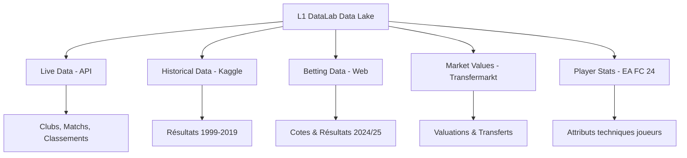

# 🌊 L1 DataLab - Data Lake & Multi-Source Strategy

Ce document détaille la structure et la provenance des données du projet L1 DataLab. L'architecture repose sur une approche **Multi-Source** combinant temps réel, historique profond et métadonnées spécialisées.

## 📌 Architecture des Données

Toutes les données brutes sont centralisées dans le dossier `data/`.



---

## 🛠️ Sources et Méthodes d'Ingestion

### 1. API Officielle (Live & Médias)
*   **Source** : `ma-api.ligue1.fr`
*   **Méthode** : Scrapy (Module `services/scraper`)
*   **Contenu** : 
    *   **Clubs** : Logos haute résolution, couleurs officielles, stades.
    *   **Matchs** : Calendrier de la semaine, scores live, journées.
    *   **Classements** : Classement général mis à jour en temps réel.
*   **Dossier** : `data/raw/`

### 2. Données Historiques (ML Training)
*   **Source** : Kaggle (`brunoo/ligue-1-results-1999-to-2019`)
*   **Méthode** : Python via `kagglehub`
*   **Contenu** : Plus de 20 ans de résultats de matchs pour l'entraînement des modèles de prédiction.
*   **Dossier** : `data/historical/`

### 3. Cotes et Paris (Predictive Analytics)
*   **Source** : `Football-Data.co.uk`
*   **Méthode** : Script Python (`requests`)
*   **Contenu** : Résultats détaillés et cotes de paris (Home/Draw/Away) pour la saison en cours (2024/2025).
*   **Dossier** : `data/betting/`

### 4. Valeurs Marchandes (Financial & Performance)
*   **Source** : Kaggle (`davidcariboo/player-scores`) via Transfermarkt
*   **Méthode** : Python via `kagglehub`
*   **Contenu** : Valuations des joueurs, historique des transferts, apparitions.
*   **Dossier** : `data/transfermarkt/`

### 5. Attributs Joueurs (Deep Analysis)
*   **Source** : Kaggle (`stefanoleone992/ea-sports-fc-24-complete-player-dataset`)
*   **Méthode** : Python via `kagglehub`
*   **Contenu** : Plus de 100 attributs techniques par joueur (vitesse, tir, mentalité, etc.).
*   **Dossier** : `data/fc24/`

---

## 🚀 Automatisation

Deux scripts principaux permettent de rafraîchir le Data Lake :

1.  **Données Externes** : 
    ```bash
    python3 scripts/download_historical_data.py
    ```
    *(Télécharge Kaggle : Historique, Transfermarkt, FC24)*

2.  **Données Betting** :
    ```bash
    python3 scripts/download_betting_odds.py
    ```
    *(Récupère les dernières cotes de la saison)*

3.  **Données Live** :
    ```bash
    cd services/scraper
    scrapy crawl l1_clubs
    scrapy crawl l1_matches
    scrapy crawl l1_standings
    ```

---

## 📈 Prochaine Étape : ETL & Data Cleaning

Le défi majeur est maintenant de **réconcilier ces sources**. 
- **Mapping des IDs** : Faire correspondre un joueur de FC24 avec son ID Transfermarkt et son club dans l'API officielle.
- **Normalisation** : Nettoyer les noms de clubs (ex: "Paris SG" vs "Paris Saint-Germain").
- **Centralisation** : Ingestion de ces fichiers CSV/JSON dans une base **PostgreSQL** pour permettre des requêtes SQL complexes et l'entraînement de modèles ML performants.
