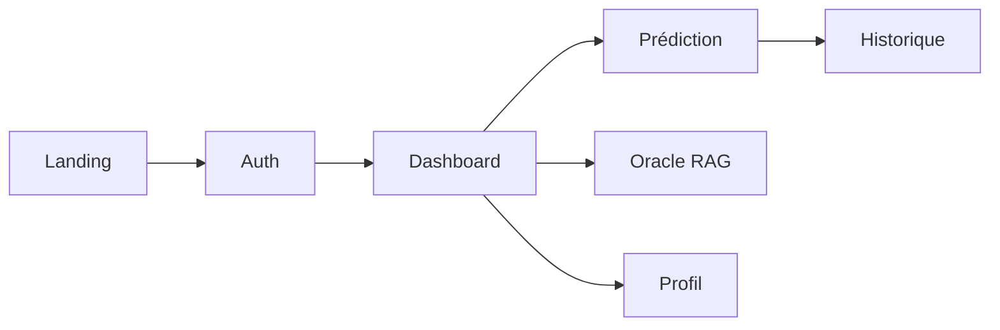

# L1 DataLab Studio : Stratégie Produit & Design

## 1. Vision stratégique

Le **L1 DataLab Studio** est une plateforme d'**Analytics Prédictif Premium** (Machine Learning as a Service) pour la Ligue 1.

Objectifs perçus :

- Profondeur technique (ML, Data Engineering, RAG, pgvector)
- Intelligence (temps réel, Oracle LLM, streaming SSE)
- Qualité premium (Liquidglass, identité sportive par club)

Inspirations : *Linear*, *Vercel*, *Anthropic*, *Perplexity*.

---

## 2. Identité produit IA sportive premium

| Pilier | Description | Statut |
|--------|-------------|--------|
| **Liquidglass** | Cartes translucides, bordures lumineuses, glows | ✅ |
| **Design tokens** | `src/theme/` — couleurs, glass, motion, oracle | ✅ branche `feature/design-tokens` |
| **Neural Core** | Prédiction idle / loading / reveal | ✅ |
| **AI Oracle** | RAG, mémoire, mood engine, SSE | ✅ |
| **Logos dynamiques** | Registre, cache, preload boot | ✅ |
| **Couleurs clubs** | `getTeamColors()` → glows contextuels | ✅ branche `feature/team-colors-visual-system` |
| **RAG sémantique** | pgvector 768D + nomic-embed | 🔜 branche `feature/pgvector-semantic-rag` |

Positionnement : **Agentic Analytics as a Service**.

---

## 3. Design token system

Structure cible (`services/frontend/src/theme/`) :

```text
theme/
├── tokens.ts      # Agrégation
├── colors.ts      # Sunset Mystique
├── glass.ts       # Opacités, blur, bordures
├── motion.ts      # Timings & easing
├── oracle.ts      # Moods Oracle (stable, risky, uncertain, glitch)
├── teams.ts       # Pont registre Ligue 1
└── applyTheme.ts  # Injection CSS variables
```

**Bénéfices** : cohérence visuelle, maintenance centralisée (`applyDesignTokens()` une fois), scalabilité nouvelles pages/composants.

Voir [`frontend-implementation.md`](./frontend-implementation.md).

---

## 4. Palette « Sunset Mystique »

| Token | Hex | Usage |
|-------|-----|-------|
| Deep Navy | `#010108` | Fond principal |
| Midnight Purple | `#20115b` | Structure |
| Electric Violet | `#7232f2` | Interactif |
| Neon Lilas | `#c876ff` | Glows |
| Sunset Pink | `#f6b3e5` | Accents |

### Couleurs clubs (registre `Ligue1Team.colors`)

Exemples d'identité sportive dynamique :

| Club | Primary | Rendu |
|------|---------|-------|
| PSG | `#004170` | Bleu électrique |
| OM | `#009FE3` | Cyan glow |
| Lens | `#D2001F` | Rouge / orange |
| Monaco | `#E2001A` | Rouge profond |

Branchées sur : cartes historique, panneaux prédiction, MatchCard, Oracle (`getOracleAccent`).

---

## 5. Liquidglass & états IA

- Bordures : `border-white/10`, `sunset-primary/30`
- Glow : `blur-[100px]`, variables `--glass-blur-*`
- États Neural Core / Oracle : **idle → loading/listening → reveal/responding**

---

## 6. Animation (GSAP)

Landing : pinning, scrub, constellation logos Ligue 1.  
Règles : pas d'effets gaming, parallax léger, timings via `theme/motion.ts`.

---

## 7. Système logos

- **Registre** : `data/teamRegistry.ts` (18 clubs, aliases, colors)
- **Cache** : `logoCache` dans `teamLogos.ts`
- **Preload** : `new Image()` au boot
- **Hydratation** : un seul `GET /standings`

---

## 8. Parcours utilisateur



---

## 9. Principes UX

1. Perception premium (pas de flicker, erreurs explicites)
2. Feedback API clair (`formatApiError`)
3. Auth 401 intelligente
4. Mobile-first, GPU-friendly

---

## 10. Documentation design & technique

| Document | Contenu |
|----------|---------|
| [`frontend-implementation.md`](./frontend-implementation.md) | Theme, logos, vues, branches |
| [`FRONTEND-PLAN.md`](./FRONTEND-PLAN.md) | Roadmap frontend |
| [`rag-implementation.md`](./rag-implementation.md) | Oracle RAG |
| [`design.md`](./design.md) | Ce fichier |
