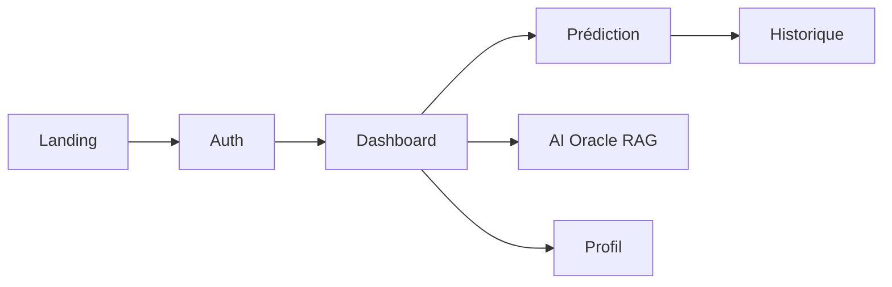

# L1 DataLab Studio : Stratégie Produit & Design

## 1. Vision stratégique

Le **L1 DataLab Studio** n'est pas un simple projet étudiant ni un dashboard administratif classique. Il s'agit d'une plateforme d'**Analytics Prédictif Premium** qui doit projeter l'image d'une véritable startup AI (Machine Learning as a Service).

Pour le jury RNCP, les recruteurs ou le portfolio GitHub, le visuel doit immédiatement transmettre :

- Profondeur technique (ML, Data Engineering, infrastructure distribuée)
- Intelligence (temps réel, agents LLM, RAG, streaming SSE)
- Qualité perçue (premium, fluide, exigeant)

Inspirations directes : *Linear*, *Vercel*, *Anthropic*, *Stripe*, *Perplexity*.

---

## 2. Identité produit IA sportive premium

L'ensemble du produit combine désormais :

| Pilier | Description |
|--------|-------------|
| **Liquidglass** | Cartes translucides, bordures lumineuses, glows directionnels |
| **Neural Core** | Animation centrale de prédiction (états idle / loading / reveal) |
| **AI Oracle (RAG)** | Assistant conversationnel avec mémoire, mood engine, SSE |
| **Logos dynamiques** | Registre Ligue 1, cache mémoire, préchargement au boot |
| **Fallbacks résilients** | Assets locaux si API/LFP indisponibles |

Le positionnement visuel : **Agentic Analytics as a Service** pour la Ligue 1.

---

## 3. Palette « Sunset Mystique »

- **Deep Navy** (`#010108`) : fond principal, mystérieux, profond
- **Midnight Purple** (`#20115b`) : structure sans gris basique
- **Electric Violet** (`#7232f2`) : éléments interactifs
- **Neon Lilas** (`#c876ff`) : glows, lueurs internes, survols
- **Sunset Pink** (`#f6b3e5`) : touches finales, rappel du ciel couchant

Couleurs secondaires contextuelles par club (registre `Ligue1Team.colors`) pour glows dynamiques futurs.

---

## 4. Direction artistique : Liquidglass

Évolution du *Glassmorphism* vers le **Liquidglass** :

- **Bordures lumineuses** : dégradés fins (`border-white/10`, `sunset-primary/30`)
- **Glow directionnel** : flous colorés sous les composants (`blur-[100px]`)
- **Minimalisme** : peu de bordures dures, espace négatif, typographie aérée
- **Focus** : qualité > quantité

### États visuels IA

- **Idle** : interface en attente, opacité réduite
- **Loading** : pulse, barre de progression, « Analyse en cours… »
- **Reveal** : résultat affiché, confiance, explainability, bannière historique

---

## 5. Animation & motion design (GSAP)

**GSAP + ScrollTrigger** sur la landing :

- **Pinning** : éléments centraux fixes pendant le scroll
- **Scrubbing** : animation liée à la position du scroll
- **Constellation tunnel** : logos Ligue 1 en profondeur (starfield)
- **Micro-interactions** : hover profondeur, loading élégants

Règles : pas d'effets « gaming », pas de zoom agressif, parallax léger uniquement.

---

## 6. Système logos & registre équipes

### Registre canonique (`teamRegistry.ts`)

Chaque club Ligue 1 expose :

```typescript
type Ligue1Team = {
  id: string              // ex. 'psg', 'om'
  canonicalName: string   // ex. 'Paris Saint-Germain'
  shortName: string       // ex. 'PSG'
  aliases: string[]       // noms API, LFP, backend
  logo: string            // asset local bundlé
  colors: TeamColors      // primary, secondary, accent
}
```

### Cache & préchargement (`teamLogos.ts`)

- `logoCache: Map<string, string>` — évite recalculs et rerenders
- `preloadTeamLogos()` — `new Image()` au boot pour transitions fluides
- `hydrateStandingsLogos()` — un seul appel `/standings`, jamais répété par vue
- Résolution : cache → API → LFP → registre local

Usages futurs : RAG, mood engine, analytics, animations par club.

---

## 7. Parcours utilisateur clés



- **Prédiction** : sélection équipes, Neural Core, persistance automatique
- **Historique** : cartes avec logos, filtres, taux de réussite
- **RAG** : chat streamé, mémoire conversationnelle, mood/confidence

---

## 8. Principes UX non négociables

1. **Perception premium** — pas de flicker logo, pas de messages d'erreur génériques
2. **Feedback explicite** — API down, email pris, historique vide vs filtré
3. **Auth cohérente** — intercepteur 401 intelligent (pas de redirect sur login/register)
4. **Mobile-first** — responsive, tactile, animations GPU-friendly

---

## 9. Niveau produit visé

Le frontend dépasse le niveau « dashboard étudiant classique » :

- Liquid glass + glow systems
- AI Oracle avec streaming SSE
- États visuels IA structurés
- Logos dynamiques + fallbacks résilients
- Typage strict équipes pour évolutions RAG/analytics

Objectif : une **identité produit IA sportive premium** crédible en soutenance et en portfolio.
