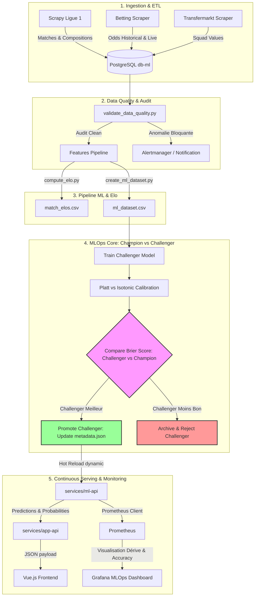
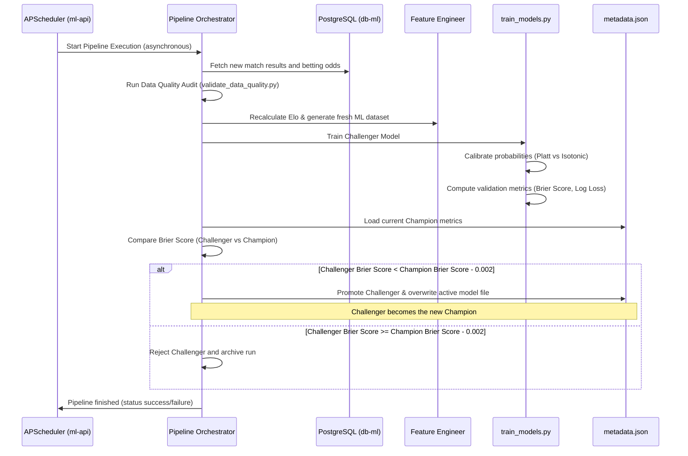

# 🧠 Guide d'Industrialisation MLOps & Vision Architecture

Ce document sert de **référence méthodologique et technique** pour la transition de la plateforme **Ligue 1 DataLab** d'un prototype de Machine Learning vers un produit IA industriel, robuste et monitoré en continu.

---

## 🎯 1. La Vision MLOps : Du Prototype au Produit IA

En Machine Learning appliqué, particulièrement dans le domaine stochastique et à haute variance des prédictions sportives, un modèle isolé dans un notebook n'a aucune valeur de production.

Notre vision industrielle repose sur trois piliers fondamentaux :
* **L'Autonomie du Pipeline** : Le football évolue chaque semaine (matchs joués, transferts, blessures, changements de coach). Le modèle doit s'adapter de lui-même sans intervention humaine, en ingérant en continu les nouvelles données et en se réentraînant périodiquement.
* **La Fiabilité de la Confiance (Calibration)** : Annoncer des probabilités aberrantes (ex : 90% de victoire à domicile sur un match équilibré) ruinerait la crédibilité de la plateforme. La calibration (Platt Scaling vs Isotonic Regression) couplée à l'analyse du **Brier Score** garantit que nos probabilités prédictives reflètent fidèlement les fréquences réelles des victoires.
* **L'Observabilité active (Concept Drift)** : Le football subit des dérives structurelles (le mercato d'hiver modifie la force intrinsèque d'une équipe, un changement tactique invalide la forme sur les 5 derniers matchs). Le système doit s'auto-surveiller pour alerter dès que le modèle perd en fiabilité.

---

## 🏗️ 2. Architecture Globale du Pipeline

L'architecture est entièrement conteneurisée via **Docker Compose** et découplée en microservices spécialisés communiquant de manière asynchrone.

---

## 🔄 3. Le Workflow Opérationnel de Réentraînement

Pour garantir une bascule sans interruption de service ("Zero-Downtime Deployment"), le pipeline suit une routine stricte de validation et de promotion à chaud.

### A. La Routine Temporelle

Chaque **lundi matin à 4h00** (ou lors d'un clic manuel sur l'interface frontend), le planificateur `APScheduler` intégré à l'API ML déclenche de manière asynchrone le script orchestrateur `ml/pipeline.py`.

### B. Platt Scaling vs Isotonic Regression : Le Combat de la Calibration

Le Random Forest produit des probabilités brutes basées sur la fraction d'arbres votant pour une classe. Cette méthode sous-estime ou surestime fréquemment la confiance.
* **Platt Scaling (Sigmoïde)** : Ajuste une régression logistique sur les probabilités de sortie. Idéal pour les petits datasets ou lorsque le biais est linéaire.
* **Isotonic Regression (Non-paramétrique)** : Ajuste une fonction monotone par morceaux. Très puissant sur de grands volumes, mais peut souffrir d'overfitting sur de petits échantillons.

Le pipeline entraîne les deux méthodes de calibration, calcule le **Brier Score** sur le set de validation temporel indépendant (les 20% derniers matchs de l'historique), et conserve la méthode la plus performante.

---

## 📈 4. Concept Drift & Détection Automatique de la Dérive

Le **Concept Drift** se produit lorsque les relations statistiques entre les features d'entrée et le résultat à prédire changent dans le temps. En Ligue 1, cela se matérialise par :
* **Le Mercato** : Un effectif transfiguré en janvier invalide les statistiques d'avant-saison.
* **L'effet "Nouveau Coach"** : Une équipe en crise (forme de 0/5) qui change de coach gagne soudainement ses matchs, déroutant les modèles basés sur l'historique récent.

### Mécanisme de Détection

L'API ML stocke les probabilités de ses 100 dernières prédictions en direct dans une file circulaire en mémoire.
1. **Surveillance de la Confiance** : Nous calculons l'écart-type et la moyenne glissante de la confiance de l'IA (la probabilité maximale prédite). Une chute prolongée indique que le modèle doute de ses prédictions.
2. **Statut Prometheus (`l1_ml_concept_drift_status`)** :
   * `0 (Stable)` : Les distributions sont conformes aux statistiques historiques.
   * `1 (Dérive Suspectée)` : La confiance moyenne a chuté de plus de 15% sur les 20 derniers matchs.
   * `2 (Drift Critique)` : Le Brier Score mensuel glissant dépasse `0.65` (modèle moins performant qu'un choix aléatoire). Un réentraînement immédiat est requis.

---

## 🔍 5. Explicabilité Locale (Proxy SHAP)

Pour ouvrir la boîte noire du modèle lors de chaque prédiction, nous avons intégré un calculateur d'impact local basé sur les écarts types historiques des caractéristiques.

### Principe de fonctionnement
1. **Comparaison de Référence** : L'API d'inférence calcule le score Z de chaque caractéristique en entrée par rapport à sa baseline saine (ex : ELO moyen de 1500).
2. **Combinaison d'Importance** : Ce score Z est pondéré par l'importance globale théorique de la variable dans le Random Forest.
3. **Pastilles de Couleurs (Frontend)** :
   * **Pastilles Cyans (+)** : Variables favorisant le résultat attendu (ex : Elo supérieur, forme domicile récente).
   * **Pastilles Mauves (-)** : Variables réduisant la confiance (ex : valeurs de transfert en baisse).

---

## 🧪 6. Suite de Tests & Auditabilité MLOps

Une suite de tests automatisée `pytest` valide les composants critiques :
* **`test_champion_model_paths`** : Garantit le chemin d'accès au modèle RandomForestCalibrated et à l'encodeur de features.
* **`test_metadata_integrity`** : Assure que le fichier `metadata.json` respecte la structure stricte (champs obligatoires, metrics, versioning).
* **`test_inference_explainability_format`** : Valide le contrat d'API et le formatage des clés d'explicabilité dynamique (`Facteur 1` débutant par `+` ou `-`).
* **`test_concept_drift_thresholds`** : Valide le basculement dynamique du statut de dérive (0, 1 ou 2) selon les moyennes de confiance simulées.

---

## 🐳 7. Industrialisation & Intégration Docker Compose

Pour assurer la persistance et la fluidité des bascules de modèles, l'infrastructure locale est ajustée via Docker :
* **Montage de Volumes** : Le dossier `/app/ml/models` de l'API ML est monté sur un volume nommé persistant. Les modèles réentraînés en direct par l'orchestrateur sont écrits directement dans ce volume partagé, ce qui évite qu'ils ne soient écrasés si le conteneur redémarre.
* **Rechargement Dynamique** : L'API d'inférence interroge le fichier `metadata.json` à intervalles réguliers (ou via un écouteur de fichier) pour recharger en mémoire le modèle champion actuel en cas de mise à jour. Ainsi, le passage de la version `v1` à la version `v2026-05-19` se fait en moins de 10 millisecondes, sans aucune interruption pour l'utilisateur.

---

## 🖥️ 8. L'Interface Frontend "AI Insights" : La Face Visible du MLOps

Le frontend Vue.js met en valeur cette architecture robuste à travers un tableau de bord hautement interactif, conçu pour illustrer la maturité technique du projet devant le jury.

### Fonctionnalités de l'écran `AI Insights`
1. **Le Centre de Commandement MLOps** :
   * Affichage en temps réel du modèle actif (ex : `RandomForestCalibrated v2026-05-19`).
   * Visualisation des métriques de validation du Champion : **Accuracy**, **Brier Score**, **Log Loss** et date du dernier entraînement.
   * **Bouton interactif** : "🔄 Relancer le Pipeline IA (ETL + Retraining)". Lors du clic, l'utilisateur voit une barre de chargement et un terminal live affichant les logs d'ingestion et d'évaluation Champion-Challenger.
2. **Le Graphique de Calibration (Reliability Diagram)** :
   * Courbe comparant les probabilités annoncées par l'IA (abscisse) et la fréquence réelle des victoires (ordonnée).
   * Une ligne diagonale parfaite représente le modèle idéal. L'utilisateur peut ainsi voir à quel point Platt ou Isotonic rapprochent notre forêt aléatoire de la perfection prédictive.
3. **Moniteur de Drift** :
   * Un composant visuel (jauge lumineuse) représentant le statut `l1_ml_concept_drift_status`. Si la jauge vire à l'orange ou au rouge, un message explicatif indique au jury que les conditions du championnat ont changé (ex : mercato) et qu'un réentraînement est nécessaire.
