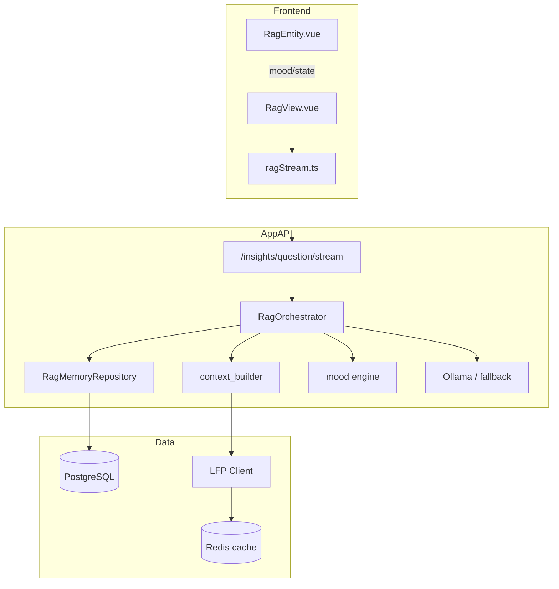

# L1 DataLab — RAG Implementation (AI Oracle)

Documentation complète de l'agent conversationnel **Oracle Football L1 DataLab** : architecture modulaire, mémoire, retrieval, génération, streaming SSE et intégration frontend.

---

## 1. Vue d'ensemble

Le RAG (Retrieval-Augmented Generation) est le cœur de l'expérience **AI Oracle** (`/rag`). Il combine :

| Source | Rôle |
|--------|------|
| **LFP API** | Classement live, contexte championnat |
| **Historique prédictions** | Prédictions H/D/A de l'utilisateur connecté |
| **Mémoire conversationnelle** | Messages passés + résumé de session |
| **Ollama** (optionnel) | LLM local pour génération naturelle |
| **Fallback contextuel** | Réponses structurées sans LLM |



---

## 2. Structure du package (`services/app-api/app/rag/`)

```text
rag/
├── orchestrator.py          # Chef d'orchestre (prepare_turn, stream, answer_once)
├── memory/
│   ├── repository.py        # CRUD conversations + messages + retrieval
│   └── embeddings.py        # Embeddings hash-based (64 dim) + cosine
├── retrieval/
│   └── context_builder.py   # Contexte LFP + mémoire + fallback answers
├── ranking/
│   └── mood.py              # Entity mood engine (stable/risky/uncertain/glitch)
├── prompts/
│   └── templates.py         # SYSTEM_PROMPT + build_user_prompt
└── generation/
    ├── ollama.py            # Client httpx streaming Ollama
    ├── fallback.py          # Génération sans LLM (mots par mots)
    └── streaming.py         # Format SSE (sse_event)
```

---

## 3. Modèle de données

### Tables (`rag_conversations`, `rag_messages`)

| Colonne | Type | Description |
|---------|------|-------------|
| `rag_conversations.id` | int | PK |
| `rag_conversations.user_id` | FK users | Propriétaire |
| `rag_conversations.title` | string | Titre auto (premier échange) |
| `rag_conversations.summary` | text | Résumé glissant (max ~2000 chars) |
| `rag_conversations.summary_embedding` | JSON | Vecteur résumé |
| `rag_messages.role` | string | `user` \| `assistant` |
| `rag_messages.content` | text | Contenu message |
| `rag_messages.embedding_json` | JSON | Vecteur message (retrieval) |
| `rag_messages.message_metadata` | JSON | mood, model, etc. |

Migration : `alembic/versions/a1b2c3d4e5f6_add_rag_conversations_messages.py`

---

## 4. Endpoints API

### POST `/insights/question` (JSON complet)

**Auth** : Bearer JWT requis.

**Body** (`RagQuestionRequest`) :

```json
{
  "question": "Qui mène le classement ?",
  "conversation_id": 12,
  "match_context": null
}
```

**Response** (`RagQuestionResponse`) :

```json
{
  "answer": "...",
  "sources": ["LFP standings API", "conversation memory"],
  "model": "l1-rag-contextual-v1",
  "conversation_id": 12,
  "mood": "stable",
  "confidence": 0.72
}
```

### POST `/insights/question/stream` (SSE — recommandé UI)

**Content-Type** : `text/event-stream`

**Événements SSE** :

| Event | Payload | Moment |
|-------|---------|--------|
| `meta` | `{ conversation_id, mood, confidence, sources, model }` | Début du tour |
| `token` | `{ t, full, mood? }` | Chaque chunk texte |
| `done` | `{ answer, ...meta }` | Fin + persistance DB |

Exemple brut :

```text
event: meta
data: {"conversation_id":3,"mood":"stable","confidence":0.68,"sources":["..."],"model":"l1-rag-contextual-v1"}

event: token
data: {"t":" Le","full":" Le","mood":"stable"}

event: done
data: {"answer":"Le PSG mène...","conversation_id":3,"mood":"stable",...}
```

### Session SSE dédiée

Le endpoint stream utilise une **`AsyncSessionLocal` séparée** dans le générateur pour éviter la fermeture prématurée de session pendant le flux long :

```python
async def event_generator():
    async with AsyncSessionLocal() as session:
        orchestrator = RagOrchestrator(session)
        async for chunk in orchestrator.stream_answer(...):
            yield chunk
        await session.commit()
```

---

## 5. Pipeline `RagOrchestrator`

### 5.1 `prepare_turn()` — préparation d'un tour

Ordre d'exécution :

1. **Conversation** — `get_or_create_conversation(user_id, conversation_id)`
2. **Message user** — persistance immédiate
3. **Prédictions** — 5 dernières via `PredictionRepository` (selectinload)
4. **Confidence estimate** — moyenne des max(prob_h, prob_d, prob_a)
5. **Retrieval mémoire** — top 4 messages par similarité cosine
6. **Messages récents** — 4 derniers tours
7. **Contexte LFP** — `build_retrieval_context()` → classement + mémoire
8. **Mood engine** — `compute_entity_mood()` → mood + confidence affichée
9. **Prompt** — `build_user_prompt(question, context_block, summary)`

### 5.2 `stream_answer()` — génération streamée

```text
prepare_turn()
    → yield SSE meta
    → stream Ollama OU fallback token-by-token
    → yield SSE token (chaque chunk)
    → persist message assistant + update summary
    → yield SSE done
```

### 5.3 `answer_once()` — réponse synchrone

Même `prepare_turn()`, puis génération complète (Ollama ou fallback), persistance, retour JSON.

---

## 6. Mémoire conversationnelle

### Embeddings légers (`memory/embeddings.py`)

- **Pas de modèle externe** : hashing SHA256 par token → vecteur 64D normalisé
- **Avantage** : zéro dépendance GPU, latence minimale, suffisant pour sessions courtes
- **Limite** : sémantique approximative (évolution : OpenAI / sentence-transformers)

```python
EMBED_DIM = 64
embed_text(text) → List[float]
cosine_similarity(a, b) → float
```

### Retrieval (`retrieve_relevant_memory`)

- Score cosine entre embedding de la question et chaque message user/assistant
- Retourne **top_k = 4** messages les plus proches
- Complété par **recent_turns** (4 derniers) pour continuité dialogue

### Résumé de session

- `update_conversation_summary()` : concatène échanges (max 2000 chars)
- Met à jour `summary_embedding` pour retrieval futur
- Auto-titre si `title == "Nouvelle analyse"`

---

## 7. Retrieval & contexte LFP

### `build_retrieval_context()`

Construit un bloc texte multi-sections :

```text
Classement LFP:
1. Paris Saint-Germain (72 pts)
2. Marseille (65 pts)
...

Prédictions analyste:
- PSG vs Marseille → H (H:49% D:24% A:27%)

Résumé session:
...

Derniers échanges:
user: ...
assistant: ...
```

**Flag `data_complete`** : `true` si standings LFP disponibles → influence le mood.

### Fallback answers (`build_fallback_answer`)

Règles keyword sans LLM :

| Mots-clés question | Comportement |
|--------------------|--------------|
| classement, standings, leader | Synthèse classement |
| prédit, pronostic, risque, confiance | Rappel prédictions + onglet Prédictions |
| psg, marseille, lyon… | Analyse équipe ciblée |
| défaut | Réponse Oracle générique + contexte |

Le fallback est aussi **streamé mot par mot** (`stream_fallback_tokens`, delay 18ms) pour l'effet typewriter premium.

---

## 8. Mood Engine (`ranking/mood.py`)

L'entité visuelle **RagEntity** reflète l'état cognitif de l'Oracle.

### Moods

| Mood | Condition | UX frontend |
|------|-----------|-------------|
| `stable` | Données OK + confiance ≥ 72% ou max_prob ≥ 72% | Glow cyan stable |
| `risky` | Mots risque/upset OU confiance basse | Animations rapides, glow rouge |
| `uncertain` | Confiance intermédiaire | Glow violet oscillant |
| `glitch` | Standings LFP indisponibles | Effet glitch, données partielles |

### Entrées du calcul

```python
compute_entity_mood(
    confidence=conf_est,           # depuis prédictions user
    data_complete=bool,            # LFP OK ?
    question=str,                  # analyse sémantique légère
    max_prediction_prob=float|None # proba max dernière prédiction
) → (mood, confidence)
```

La `confidence` retournée alimente l'UI (jauge, intensité stream).

---

## 9. Génération LLM (Ollama)

### Configuration

| Variable | Défaut | Description |
|----------|--------|-------------|
| `OLLAMA_URL` | *(vide)* | Si défini → mode LLM |
| `OLLAMA_MODEL` | `qwen2.5:7b` | Modèle Ollama |

### Client (`generation/ollama.py`)

- `POST {OLLAMA_URL}/api/generate` avec `stream: true`
- Parse lignes JSON NDJSON (`response`, `done`)
- `stream_ollama()` → AsyncIterator[str]
- `generate_ollama_once()` → agrégation pour endpoint JSON

Si Ollama échoue ou URL absente → **fallback automatique**.

---

## 10. Intégration frontend

### Fichiers clés

| Fichier | Rôle |
|---------|------|
| `views/RagView.vue` | Chat Oracle, suggestions, historique messages |
| `components/rag/RagEntity.vue` | Avatar animé (idle/listening/generating/responding) |
| `api/ragStream.ts` | Client fetch + parse SSE |

### États `RagEntity`

```text
idle        → respiration lente
listening   → input focus + texte saisi
generating  → stream actif (intensité liée aux tokens)
responding  → flash final après done
```

Classes CSS modulées par **mood** : `--mood-stable`, `--mood-risky`, `--mood-uncertain`, `--mood-glitch`.

### Client SSE (`streamRagQuestion`)

```typescript
await streamRagQuestion(question, {
  onMeta: (meta) => { conversationId, entityMood, confidence },
  onToken: (payload) => { append to assistant message, streamIntensity++ },
  onDone: (payload) => { finalize, sources, model },
  onError: (err) => { ... },
}, conversationId)
```

- Auth via `Authorization: Bearer` (localStorage)
- `conversation_id` renvoyé dans `meta` → réutilisé pour continuité multi-tours

### Route

- `/rag` — `meta: { requiresAuth: true }`
- Lien nav : **RAG Agent**

---

## 11. Schémas Pydantic

```python
class RagQuestionRequest(BaseModel):
    question: str = Field(..., min_length=2, max_length=2000)
    match_context: Optional[str] = None
    conversation_id: Optional[int] = None

class RagQuestionResponse(BaseModel):
    answer: str
    sources: List[str] = []
    model: Optional[str] = None
    conversation_id: Optional[int] = None
    mood: Optional[str] = None
    confidence: Optional[float] = None
```

---

## 12. Tests manuels

### Stream SSE (curl)

```bash
TOKEN="..." # JWT

curl -N -X POST http://localhost:8002/insights/question/stream \
  -H "Authorization: Bearer $TOKEN" \
  -H "Content-Type: application/json" \
  -d '{"question":"Qui mène le classement Ligue 1 ?"}'
```

### JSON synchrone

```bash
curl -X POST http://localhost:8002/insights/question \
  -H "Authorization: Bearer $TOKEN" \
  -H "Content-Type: application/json" \
  -d '{"question":"Analyse mes dernières prédictions"}'
```

### Avec Ollama local

```bash
# docker-compose ou host
export OLLAMA_URL=http://host.docker.internal:11434
export OLLAMA_MODEL=qwen2.5:7b
docker compose up -d app-api
```

---

## 13. Évolutions prévues

| Priorité | Évolution |
|----------|-----------|
| Haute | Embeddings sémantiques (sentence-transformers / API) |
| Haute | Brancher `teamRegistry` / `resolveTeamWithLogo` dans contexte |
| Moyenne | Vector store dédié (pgvector / Qdrant) |
| Moyenne | Historique conversations listable côté UI |
| Basse | RAG sur stats match individuelles (xG, forme) |
| Basse | Citations sources cliquables dans la réponse |

---

## 14. Liens documentation

- [`backend-implementation.md`](./backend-implementation.md) — App API globale
- [`design.md`](./design.md) — identité Oracle & mood visuel
- [`FRONTEND-PLAN.md`](./FRONTEND-PLAN.md) — RagView & stack frontend
- [`DOCKER.md`](./DOCKER.md) — ports et services

---

## 15. Résumé technique

Le RAG L1 DataLab est un **agent contextuel football** production-ready pour démo :

- Mémoire persistante PostgreSQL
- Retrieval hybride (LFP + prédictions user + mémoire session)
- Double mode génération (Ollama / fallback streamé)
- SSE temps réel avec mood engine synchronisé UI
- Architecture modulaire extensible vers embeddings avancés et analytics club
